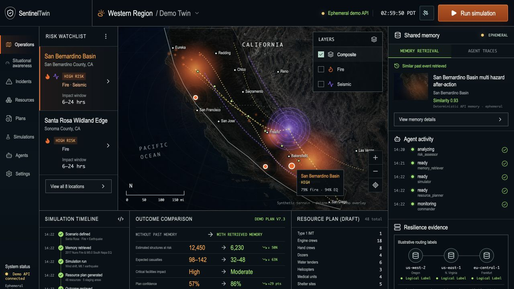
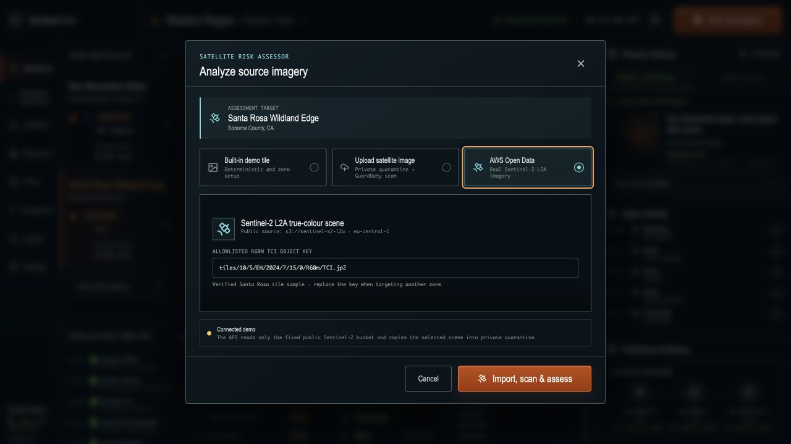
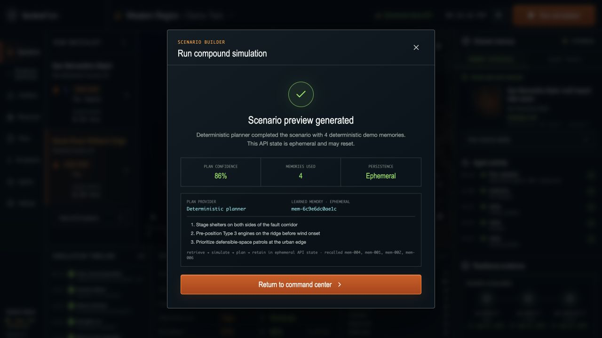
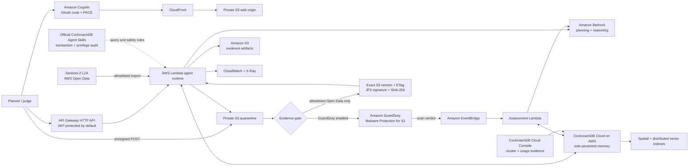

# SentinelTwin

**A multi-hazard digital twin whose agents remember.** SentinelTwin turns satellite-derived terrain signals into wildfire, earthquake, and agricultural-resilience evidence, retrieves similar historical situations, simulates response options, and persists every observation, decision, and outcome in CockroachDB Cloud. AWS Lambda runs the agent loop, Amazon Bedrock supplies plan reasoning, API Gateway exposes the service, and S3 retains source/evidence artifacts. Deterministic embeddings keep recall reproducible and are indexed in CockroachDB.

> Decision-support prototype for the CockroachDB × AWS Hackathon. It does not replace emergency authorities or guarantee real-world safety outcomes.

[](https://github.com/Developer668/sentineltwin/actions/workflows/ci.yml)
[](LICENSE)



<p align="center">
  
  
</p>

<p align="center"><sub>Captured from the running local application. The visible “Demo API” and “Ephemeral” labels are intentional; cloud claims require the deployment checks below.</sub></p>

## Why memory is load-bearing

A stateless risk chatbot repeats itself. SentinelTwin has an auditable loop:

1. **Observe** a location and terrain/hazard signals.
2. **Remember** the assessment and embedding transactionally in CockroachDB.
3. **Retrieve** spatially and semantically similar prior incidents with CockroachDB distributed vector indexing.
4. **Simulate** response scenarios and recommend resource positioning with Bedrock-assisted agents.
5. **Learn** by persisting plans/outcomes so the next run can cite and improve on prior memory.

If durable memory is unavailable, the API reports a degraded state; it must never claim an action was remembered when it was not.

## Architecture



See [docs/ARCHITECTURE.md](docs/ARCHITECTURE.md) for boundaries, data flow, and resilience behavior.

## Hackathon integrations

| Requirement | Concrete use |
|---|---|
| CockroachDB distributed vector indexing | Embeddings live beside structured/spatial memories; nearest-neighbor recall needs no second vector database. |
| CockroachDB Agent Skills Repo | The official transaction-design and privilege-hardening skills were executed against this repository. They directly produced jittered serializable retries, atomic memory writes, least-privilege checks, and the recorded audit in `docs/COCKROACHDB_AGENT_SKILLS_AUDIT.md`. |
| AWS Lambda + API Gateway | Serverless execution and HTTPS API for every assessment/simulation tick. |
| Amazon Bedrock | Agent planning/reasoning through Bedrock Runtime `Converse`; no third-party model API. Embeddings are deterministic feature hashes for the hackathon dataset. |
| Amazon S3 + optional [GuardDuty Malware Protection](https://docs.aws.amazon.com/guardduty/latest/ug/monitor-with-eventbridge-s3-malware-protection.html) + EventBridge | With GuardDuty enabled, browser uploads and Open Data scenes enter private quarantine and only the exact version tagged `NO_THREATS_FOUND` can reach Bedrock. When the account cannot activate GuardDuty, browser uploads fail closed and only the trusted Open Data path is available. |
| [Sentinel-2 on AWS Open Data](https://registry.opendata.aws/sentinel-2/) | The API reads only `sentinel-s2-l2a` in `eu-central-1`, validates a strict L2A `R60m/TCI.jp2` key, bounded size, and JPEG-2000 signature, then copies it to versioned S3 with its upstream ETag and SHA-256. In trusted-source mode it re-reads that exact S3 version and verifies the stored hash before Bedrock. |
| Agricultural Resilience | A simulation can run only from a CockroachDB-persisted, Bedrock-assessed Sentinel-2 observation. Satellite vegetation, moisture, slope, and fire risk are evidence; rainfall deficit, heat anomaly, and irrigation coverage remain visibly named operator assumptions—not fabricated weather. Each outcome becomes a durable, recallable memory. |
| Amazon Cognito | Admin-invite login uses authorization code + PKCE and optional software TOTP; API Gateway validates JWT issuer/audience/scope and Lambda requires the `sentineltwin-operators` group. The dedicated judge account is removed after judging. |

Claims and evidence commands are cataloged in [docs/COCKROACHDB_TOOLS.md](docs/COCKROACHDB_TOOLS.md).

## Local setup

Prerequisites: Python 3.12+, Node.js 22.13.0+, `pnpm`, and the CockroachDB SQL CLI; AWS CLI/SAM and a running Docker daemon are needed only for AWS deployment. `ccloud` is supported by an optional guarded provisioning script, but the submitted cluster was created and verified through CockroachDB Cloud Console. Docker is not needed for the isolated local CockroachDB test.

```bash
cp .env.example .env
make check
make install
```

For a UI-only walkthrough, keep `SENTINEL_DEMO_MODE=true`; that mode is deterministic and **not persistent memory**. For the qualifying end-to-end path:

```bash
ccloud auth login
make provision-db
# Set DATABASE_URL in your shell to the TLS CockroachDB Cloud URL.
make db-bootstrap
make db-verify
export SENTINEL_DEMO_MODE=false
make api
```

Production bootstrap excludes `database/migrations/002_seed.sql`; a new cloud database therefore starts with schema and canonical agent configuration but no fabricated locations, populations, hazard observations, or memories. Only an explicitly labeled demo database should set `SENTINEL_APPLY_DEMO_FIXTURES=true`. Use `make db-test-cloud` to run an opt-in live persistence/recall test whose temporary records are removed afterward.

In another terminal:

```bash
make web
```

Open [http://localhost:5173](http://localhost:5173). The frontend defaults to the zero-dependency API at `http://127.0.0.1:8787`; the client appends `/api`. Cognito is not required for loopback development. Never put `DATABASE_URL`, AWS credentials, or bearer tokens in a `VITE_*` variable—Vite variables are shipped to the browser.

Useful checks:

```bash
make test
make lint
make smoke API_BASE_URL=http://127.0.0.1:8787/api
make load-test # read-only by default; reports RPS, p50/p95/p99, errors, and statuses
# Optional: isolated real CockroachDB 25.4+ schema/API test, no Docker.
make db-test-local COCKROACH_BINARY=/absolute/path/to/cockroach
```

## Deploy to AWS

The safe path stores the Cockroach URL as `{"DATABASE_URL":"postgresql://..."}` in AWS Secrets Manager and passes only its ARN to Lambda.

```bash
export AWS_PROFILE=default AWS_REGION=us-west-2
export DATABASE_URL='postgresql://.../sentineltwin?sslmode=verify-full'
make secret
make deploy
```

`make deploy` creates an admin-invite Cognito pool with optional software-token MFA, a `sentineltwin-operators` group, and a no-secret SPA client/Hosted UI. Long-lived operators should enroll TOTP; the temporary judge account is intentionally password-only and must be removed after judging. It defaults to `AUTH_MODE=cognito`; `AUTH_MODE=public` is an explicit short-lived opt-out accepted only with `SENTINEL_DEMO_MODE=true` and no CockroachDB secret. In public mode, S3/Bedrock runtime configuration and IAM are removed and the ingestion rule is disabled, so only synthetic deterministic paths remain. Cognito mode is required for real AWS/Cockroach persistence. Create an operator and add it to the emitted group as documented, then build and upload from stack outputs:

```bash
make deploy-web
```

`deploy-frontend.sh` injects only the public API/Cognito identifiers required for OAuth code + PKCE. Finally redeploy with the emitted CloudFront URL as the exact CORS origin. Full operator creation, parameters, IAM behavior, smoke tests, cost controls, and rollback are in [docs/DEPLOYMENT.md](docs/DEPLOYMENT.md).

Lambda packaging defaults to `sam build --use-container` because the Python artifact includes native `psycopg` and Pillow wheels; host-native macOS packages are never deployed. The Lambda architecture is fixed to x86_64 so an exact Python 3.12 Linux x86_64 environment (including AWS CloudShell after installing Python 3.12) may instead set `SENTINEL_SAM_BUILD_MODE=native-linux`.

GuardDuty is enabled by default. If an account or protected-free-plan restriction prevents activation, set `GUARDDUTY_MALWARE_PROTECTION_ENABLED=false`. That mode does not silently weaken arbitrary uploads: browser upload authorization is disabled, and the only accepted imagery is a strict Sentinel-2 AWS Open Data key whose exact destination version, ETag, JPEG-2000 signature, and SHA-256 are verified before Bedrock.

## API and demo

The primary experience is sign in → map → import real Sentinel-2 imagery → verify the exact source/object evidence → Bedrock assessment → inspect the updated risk → run an agricultural or multi-hazard scenario → inspect retrieved memories → rerun to prove persistence. `scripts/smoke-test.sh` exercises the API path; `scripts/smoke-satellite.sh` verifies the optional browser-upload/GuardDuty path; `scripts/smoke-sentinel-import.sh` verifies the real AWS Open Data → verified AWS evidence → Bedrock → CockroachDB path.

The judge-ready narration is [docs/DEMO_SCRIPT.md](docs/DEMO_SCRIPT.md) and is timed to 2:40. Submission URLs and evidence remain intentionally unchecked until a real deployment exists: [docs/SUBMISSION.md](docs/SUBMISSION.md).

## Security and reliability

- CockroachDB Cloud is the sole durable store; TLS verification is mandatory.
- CockroachDB SQL ingress must be limited to approved admin/application egress CIDRs or supported private connectivity; `0.0.0.0/0` is demo-only, and this stack does not guess Lambda egress ranges.
- Browser code never receives database credentials, AWS credentials, MCP tokens, or raw secret ARNs.
- Cloud APIs use Cognito JWT authorization plus server-enforced operator-group membership by default; the only intentionally public API route is a sanitized health response.
- Lambda has resource-scoped S3, selected-model Bedrock, and selected-secret permissions.
- Both S3 buckets are encrypted and block public access; CloudFront uses signed origin access and security headers.
- When enabled, GuardDuty Malware Protection scans the quarantine prefix and tags exact object versions. The ingestion Lambda re-reads the tag before fetching any bytes; raw S3 creation events cannot bypass this gate. When disabled, arbitrary uploads are disabled and the real Open Data importer verifies strict provenance and the exact copied bytes instead.
- Real imagery import is allowlisted to the public Sentinel-2 L2A bucket/key format, capped at 12 MB, magic-byte checked, and safely converted from JPEG 2000 only after a clean scan.
- Satellite ingestion has separate concurrency, retries, logs, an alarm, and an encrypted dead-letter queue.
- API throttling, tunable reserved concurrency/database-pool caps, structured access logs, 30-day Lambda logs, alarms, X-Ray, and a safe read-only load harness are included.
- Source provenance, timestamps, model identity, confidence, and human approval remain part of safety-sensitive output.

Read [docs/SECURITY.md](docs/SECURITY.md), the current [security review](security_best_practices_report.md), and [docs/OPERATIONS.md](docs/OPERATIONS.md) before making the demo public.

## Repository map

```text
backend/                 Lambda/API, agents, memory access, simulation
database/                CockroachDB schema/migrations and seed data
frontend/                Vite dashboard
infra/template.yaml      AWS SAM + CloudFormation resources
infra/mcp/               Managed MCP read-only config and sanitized evidence query
scripts/                 Provision, bootstrap, deploy, verify, smoke test
docs/                    Architecture, operations, demo, submission evidence
```

## Status

The public source repository is [Developer668/sentineltwin](https://github.com/Developer668/sentineltwin). A real CockroachDB Cloud database is configured and verified from this checkout; AWS infrastructure and the public application are not yet deployed. Read [HANDOFF.md](HANDOFF.md) for the exact remaining work and verification gaps. The submission should only claim evidence it can show.

## License

[MIT](LICENSE)
